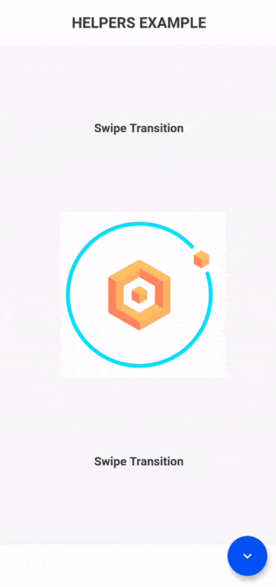

# helpers

## My other APIs

- [Scroll Navigation](https://pub.dev/packages/scroll_navigation)
- [Video Viewer](https://pub.dev/packages/video_viewer)
- [Video Editor](https://pub.dev/packages/video_editor)

<br>

## Features

- Better readability in code.
- More intuitive statements.
- Faster when declaring.
- Shorten long and tedious statements.

<br>

## Table of Contents

- [Misc Classes](#misc-helpers)
  - [Misc](#misc-class)
  - [SystemOverlay](#systemoverlay-class)
  - [SystemOrientation](#systemorientation-class)
- [Context Classes](#context-helpers)
  - [GetMedia](#getmedia-class)
  - [GetColor](#getcolor-class)
- [Size Classes](#size-helpers)
  - [GetKey](#getkey-class)
  - [Margin](#margin-class)
  - [EdgeRadius](#edgeradius-class)
- [PushRoute Class](#pushroute-class)
- [Text Helpers](#text-helpers)
  - [TextDesigned](#textdesigned-widget)
  - [Themed Text](#themed-text-widgets)
- [Widgets Helpers](#widgets-helpers)
  - [RemoveScrollGlow](#removescrollglow-widget)
  - [DismissKeyboard](#dismisskeyboard-widget)
  - [SizeBuilder](#sizebuilder-widget)
  - [TransparentBox](#transparentbox-widget)
  - [ExpandedSpacer](#expandedspacer-widget)
  - [ExpandedTap](#expandedtap-widget)
  - [SafeAreaColor](#safeareacolor-widget)
  - [AnimatedInteractiveViewer](#animatedinteractiveviewer-widget)
- [Transition Helpers](#transition-helpers)
  - [BooleanTween](#booleantween-widget)
  - [OpacityTransition](#opacitytransition-widget)
  - [SwipeTransition](#swipetransition-widget)
  - [TurnTransition](#turntransition-widget)

<br><br>



<br><br>

# Documentation

## Misc Helpers

- ### **Misc Class:**
  It is a simplification of many instructions.

```dart
    double milliseconds = 200;

    //THEME
    Misc.theme(context);          //Helper
    Theme.of(context);

    Misc.textTheme(context);      //Helper
    Theme.of(context).textTheme;


    //CALLBACKS
    Misc.onLayoutRendered(() {}); //Helper
    WidgetsBinding.instance.addPostFrameCallback((_) {});


    //TIMER-ASYNC
    Misc.delayed(milliseconds, () {});  //Helper
    Future.delayed(Duration(milliseconds: milliseconds), () {});

    Misc.timer(milliseconds, () {});    //Helper
    Timer(Duration(milliseconds: milliseconds), () {});

    Misc.periodic(milliseconds, () {}); //Helper
    Timer.periodic(Duration(milliseconds: milliseconds), () {});

    await Misc.wait(milliseconds);      //Helper
    await Future.delayed(Duration(milliseconds: milliseconds), () {});


    //TEXT
    Text(Misc.loremIpsum());
    Text("Lorem ipsum dolor sit amet, consectetur adipiscing elit, " +
        "sed do eiusmod tempor incididunt ut labore et dolore magna aliqua.");

    Text(Misc.extendedLoremIpsum());
    Text("Lorem ipsum dolor sit amet, consectetur adipiscing elit, " +
        "sed do eiusmod tempor incididunt ut labore et dolore magna aliqua." +
        "Ut enim ad minim veniam, quis nostrud exercitation " +
        "ullamco laboris nisi ut aliquip ex ea commodo consequat.");


    //SYSTEM (NOTE: SystemChrome NEED IMPORT FLUTTER SERVICES)
    Misc.setSystemOverlayStyle(...); //Helper
    SystemChrome.setSystemUIOverlayStyle(SystemUiOverlayStyle(...));

    Misc.setSystemOverlay(SystemOverlay.portraitUp);     //Helper
    SystemChrome.setSystemUIOverlay([SystemUiOverlay.portraitUp]);

    Misc.setSystemOrientation(SystemOrientation.values); //Helper
    SystemChrome.setPreferredOrientations(DeviceOrientation.values)

```

<br>

- ### **SystemOverlay Class:**

  This is a simplification of the _List type: SystemUiOverlay_ statement. It is used for the _Misc.setSystemOverlayStyle()_ statement.
  **IMPROVEMENT**: By using the SystemOverlay you will not need to import _SystemChrome, DeviceOrientation_ from the flutter services.

```dart
    SystemOverlay.values; //Helper
    SystemUiOverlay.values

    SystemOverlay.top;    //Helper
    [SystemUiOverlay.top]

    SystemOverlay.bottom; //Helper
    [SystemUiOverlay.bottom]
```

<br>

- ### **SystemOrientation Class:**

  This is a simplification of the _List type: DeviceOrientation_ statement. It is used for the _Misc.setSystemOrientation()_ statement.
  **IMPROVEMENT**: By using the SystemOrientation you will not need to import _SystemChrome, DeviceOrientation_ from the flutter services.

```dart
    //INSTRUCTIONS
    SystemOrientation.values;         //Helper
    DeviceOrientation.values;

    SystemOrientation.portraitUp;     //Helper
    [DeviceOrientation.portraitUp];

    SystemOrientation.portraitDown;   //Helper
    [DeviceOrientation.portraitDown];

    SystemOrientation.landscapeLeft;  //Helper
    [DeviceOrientation.landscapeLeft];

    SystemOrientation.landscapeRight; //Helper
    [DeviceOrientation.landscapeRight]
```

<br>

---

<br>

## Context Helpers

- ### **GetMedia Class:**
  It is a simplification of the _MediaQuery.of(context)_ statement.

```dart

    final GetMedia media = GetMedia(context);
    final MediaQueryData query = MediaQuery.of(context);

    media.width;    //Helper
    query.size.width;

    media.height;   //Helper
    query.size.height;

    media.padding;  //Helper
    query.padding;

    media.size;     //Helper
    query.size;

    ... //+10 MEDIAQUERIES
```

<br>

- ### **GetColor Class:**

It is a simplification of the _Theme.of(context)_ statement.

```dart
    final GetColor color = GetColor(context);
    final ThemeData theme = Theme.of(context);

    color.primary;      //Helper
    theme.primaryColor;

    color.primaryLight; //Helper
    theme.primaryColorLight;

    color.accent;       //Helper
    theme.accentColor;

    color.disabled;     //Helper
    theme.disabledColor;

    color.scaffold;     //Helper
    theme.scaffoldBackgroundColor;

    ... //+20 COLORS
```

<br>

---

<br>

## Size Helpers

- ### **GetKey Class:**
  It is a simplification of the _GlobalKey()_ statement.

```dart
    final GlobalKey key = GlobalKey();
    final GetKey data = GetKey(key);

    data.width;   //Helper
    key.currentContext.size.width;

    data.height;  //Helper
    key.currentContext.size.height;

    data.size;    //Helper
    key.currentContext.size;

    data.context; //Helper
    key.currentContext;

    data.state;   //Helper
    key.currentState;
```

<br>

- ### **Margin Class:**
  It is a simplification of the _EdgeInsets_ statement.

```dart
    double amount = 2.0;


    Margin.zero; //Helper
    EdgeInsets.zero;

    Margin.all(amount); //Helper
    EdgeInsets.all(amount);


    //SYMETRIC
    Margin.vertical(amount);   //Helper
    EdgeInsets.symmetric(vertical: amount);

    Margin.horizontal(amount); //Helper
    EdgeInsets.symmetric(horizontal: amount);

    Margin.symmetric(...);     //Helper
    EdgeInsets.symmetric(...);


    //ONLY
    Margin.top(amount);    //Helper
    EdgeInsets.only(top: amount);

    Margin.bottom(amount); //Helper
    EdgeInsets.only(bottom: amount);

    Margin.left(amount);   //Helper
    EdgeInsets.only(left: amount);

    Margin.right(amount);  //Helper
    EdgeInsets.only(right: amount);

    Margin.only(...);      //Helper
    EdgeInsets.only(...);
```

<br>

- ### **EdgeRadius Class:**
  It is a simplification of the _BorderRadius_ statement.

```dart
    double amount = 2.0;


    EdgeRadius.zero;        //Helper
    BorderRadius.zero;

    EdgeRadius.all(amount); //Helper
    BorderRadius.all(Radius.circular(amount));


    //SYMETRIC
    EdgeRadius.vertical(top: amount, bottom: amount);   //Helper
    BorderRadius.vertical(
      top: Radius.circular(top),
      bottom: Radius.circular(bottom));

    EdgeRadius.horizontal(left: amount, right: amount); //Helper
    BorderRadius.horizontal(
      left: Radius.circular(left),
      right: Radius.circular(right));


    //ONLY
    EdgeRadius.only( //Helper
      topLeft: amount,
      topRight: amount,
      bottomLeft: amount,
      bottomRight: amount);
    BorderRadius.only(
      topLeft: Radius.circular(topLeft),
      topRight: Radius.circular(topRight),
      bottomLeft: Radius.circular(bottomLeft),
      bottomRight: Radius.circular(bottomRight));
```

<br>

---

<br>

## Routes Helpers

- ### **PushRoute Class:**
  It is a simplification of the _Navigator.push()_ statement.
  **TranparentPage** solved the bug of MaterialPageRoute with a black background

```dart
    Widget page;
    BuildContext context;


    PushRoute.page(context, page); //Helper
    Navigator.push(context,
      transition
          ? MaterialPageRoute(builder: (_) => page)
          : PageRouteBuilder(pageBuilder: (_, __, ___) => page))


    PushRoute.replacement(context, page); //Helper
    Navigator.pushReplacement(context,
      transition
          ? MaterialPageRoute(builder: (_) => page)
          : PageRouteBuilder(pageBuilder: (_, __, ___) => page))


    PushRoute.transparentPage(context, page) //Helper
    Navigator.push(context,
      TransparentRoute(builder: (_) => page, transitionMs: transitionMs))
```

<br>

---

<br>

## Text Helpers

- ### **TextDesigned Widget:**
  It is a _Text Widget simplification_.

```dart
    //HELPER
    TextDesigned(
      "Hello",
      size: 20,
      bold: true,
      underline: true,
      color: Colors.white,
    );

    //NORMAL WIDGET
    Text(
      "Hello",
      style: TextStyle(
        fontSize: 20,
        color: Colors.white,
        fontWeight: FontWeight.bold,
        decoration: TextDecoration.underline,
      ),
    );

```

<br>

- ### **Themed Text Widgets:**
  Text Widgets with the TextTheme Style.

```dart
    //HEADLINES
    Headline1("Hi");
    Text("Hi", style: Misc.textTheme(context).headline1);

    Headline2("Hi");
    Text("Hi", style: Misc.textTheme(context).headline2);

    Headline3("Hi");
    Text("Hi", style: Misc.textTheme(context).headline3);

    Headline4("Hi");
    Text("Hi", style: Misc.textTheme(context).headline4);

    Headline5("Hi");
    Text("Hi", style: Misc.textTheme(context).headline5);

    Headline6("Hi");
    Text("Hi", style: Misc.textTheme(context).headline6);


    //SUBTITLES
    Subtitle1("Hi");
    Text("Hi", style: Misc.textTheme(context).subtitle1);

    Subtitle2("Hi");
    Text("Hi", style: Misc.textTheme(context).subtitle2);


    //BODYTEXTS
    BodyText1("Hi");
    Text("Hi", style: Misc.textTheme(context).bodytext1);

    BodyText2("Hi");
    Text("Hi", style: Misc.textTheme(context).bodytext2);


    //OTHER
    Overlinetext("Hi");
    Text("Hi", style: Misc.textTheme(context).overline);

    CaptionText("Hi");
    Text("Hi", style: Misc.textTheme(context).caption);

    ButtonText("Hi");
    Text("Hi", style: Misc.textTheme(context).button);
```

<br>

---

<br>

## Widgets Helpers

- ### **RemoveScrollGlow Widget:**
  Eliminate the Splash Effect or Glow Effect when reaching the limit of a PageView, ScrollView, ListView, etc.

```dart
    //EXAMPLE
    RemoveScrollGlow(child: PageView(...));

    //WIDGET RETURN THAT
    return NotificationListener<OverscrollIndicatorNotification>(
      onNotification: (OverscrollIndicatorNotification overscroll) {
        overscroll.disallowGlow();
        return;
      },
      child: PageView(...),
    );
```

<br>

- ### **DismissKeyboard Widget:**
  Tapping on a Widget will apply the FocusScope to it and hide the keyboard.

```dart
    //EXAMPLE
    DismissKeyboard(child: Container());

    //WIDGET RETURN THAT
    return GestureDetector(
      onTap: () {
        FocusScopeNode focus = FocusScope.of(context);
        if (!focus.hasPrimaryFocus) focus.requestFocus(FocusNode());
      },
      child: Container(),
    );
```

- ### **SizeBuilder Widget:**
  It works like the LayoutBuilder but only returns the _maxWidth_ and _maxHeight_

```dart
    //EXAMPLE
    SizeBuilder(builder: (width, height) {
      Size layout = Size(width, height);
      return Container(
        width: width,
        height: height,
        color: Colors.red,
      );
    });

    //WIDGET RETURN THAT
    return LayoutBuilder(builder: (_, constraints) {
      return widget.builder(constraints.maxWidth, constraints.maxHeight);
    });
```

- ### **TransparentBox Widget:**
  It is normally used within a GestureDetector to detect the tap.

```dart
    //EXAMPLE
    GestureDetector(
      onTap: () => print("hello"),
      child: TransparentBox(child: Text("Hello!"))
    )

    //WIDGET RETURN THAT
    return Container(color: Colors.transparent);
```

- ### **ExpandedSpacer Widget:**
  It is used as a spacer within a [Row] or [Column].

```dart
    //EXAMPLE
    Column(children: [
      Expanded(child: Icon(Icons.chevron_left)),
      ExpandedSpacer(),
      ExpandedSpacer(),
      Expanded(child: Icon(Icons.chevron_right)),
    ])

    //WIDGET RETURN THAT
    return Expanded(child: SizedBox());
```

- ### **ExpandedTap Widget:**
  It is normally used for icons or texts within a [Row].

```dart
    //EXAMPLE
    Row(children: [
      ExpandedTap(
        onTap:  () => print("CANCEL"),
        child: TransparentBox(
          child:Center(
            child: TextDesigned(
              "CANCEL",
              color: Colors.white,
              bold: true,
            ),
          ),
        ),
      ),
      ExpandedTap(
        onTap: () => print("CALL CALLBACK"),
        child: TransparentBox(
          child: Center(
            child: TextDesigned(
              "OK",
              color: Colors.white,
              bold: true,
            ),
          ),
        ),
      ),
    ])

    //WIDGET RETURN THAT
    return Expanded(
      child: GestureDetector(
        onTap: onTap,
        child: child,
      ),
    );
```

- ### **SafeAreaColor Widget:**
  Used to create your own AppBar

```dart
    //EXAMPLE
    Column(children: [
      SafeAreaColor(
        color: Colors.white,
        height: 60,
        child: Center(TextDesigned("APP BAR", bold: true)),
      ),
      ExpandedSpacer(),
      Container(
        height: 60,
        color: Colors.white,
        width: double.infinity,
        child: Center(TextDesigned("BOTTOM NAV", bold: true)),
      ),
    ])

    //WIDGET RETURN THAT
    return Container(
      color: color,
      width: width,
      child: SafeArea(
        child: Container(
          height: height,
          child: child,
        ),
      ),
    );
```

- ### **AnimatedInteractiveViewer Widget:**
  It is an InteractiveViewer with enhanced double tap zooming.

```dart
    //EXAMPLE
    AnimatedInteractiveViewer(
      child: Image.network(
          "https://avatars0.githubusercontent.com/u/65832922?s=460&u=67f908b168ae2934f9e832af2180825c6b2f0e37&v=4"),
    ),
```

<br>

---

<br>

## Transition Helpers

- ### **BooleanTween Widget:**

  It is an AnimatedBuilder. If it is **TRUE**, it will execute the Tween from _begin to end (controller.forward())_, if it is **FALSE** it will execute the Tween from _end to begin (controller.reverse())_

  **IT IS THE CORE OF ALL TRANSITIONS**.

```dart
    //EXAMPLE
    bool animate = true;

    BooleanTween(
      animate: animate,
      tween: ColorTween(begin: Colors.blue, end: Colors.red),
      builder: (dynamic color) {
        return Container(color: color);
      },
    );
```

<br>

- ### **OpacityTransition Widget:**
  Show or hide a Widget with an **Fade Transition** from a Boolean variable.

```dart
    //EXAMPLE
    bool visible = true;

    OpacityTransition(
      visible: visible,
      child: Container(),
    );
```

<br>

- ### **SwipeTransition Widget:**
  Show or hide a Widget with an **Slide Transition** from a Boolean variable.

```dart
    //EXAMPLE
    bool visible = true;

    SwipeTransition(
      visible: visible,
      direction: SwipeDirection.fromTop,
      child: Center(child: TextDesigned("Swipe Transition", bold: true)),
    ),
```

<br>

- ### **TurnTransition Widget:**
  Turn a Widget with a Boolean variable.

```dart
    //EXAMPLE
    bool turn = true;

    TurnTransition(
      turn: turn,
      child: Icon(Icons.chevron_left),
    );
```
