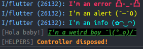
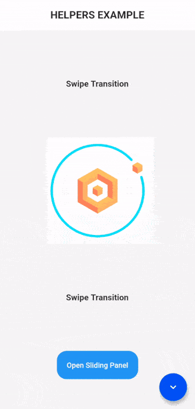

# helpers

## My other APIs

- [Scroll Navigation](https://pub.dev/packages/scroll_navigation)
- [Video Viewer](https://pub.dev/packages/video_viewer)
- [Video Editor](https://pub.dev/packages/video_editor)

<br>

## Features

- Better readability in code.
- More intuitive statements.
- Faster when declaring.
- Shorten long and tedious statements.

<br>

## Table of Contents

- [BuildContext Extension](#buildcontext-extension) **FAVORITE Plus**
- [Console Color Log](#console-color-log) **FAVORITE**
- [Build Classes](#build-helpers) 
  - [BuildMedia](#buildmedia-class)
  - [BuildColor](#buildcolor-class) 
  - [BuildRoute](#buildroute-class) 
- [Misc Classes](#misc-helpers)
  - [Misc](#misc-class) **FAVORITE**
  - [SystemOverlay](#systemoverlay-class)
  - [SystemOrientation](#systemorientation-class)
- [Size Classes](#size-helpers)
  - [Margin](#margin-class) **FAVORITE**
  - [EdgeRadius](#edgeradius-class)
- [Text Helpers](#text-helpers)
  - [TextDesigned](#textdesigned-widget)
  - [Themed Text](#themed-text-widgets) **FAVORITE**
- [Transition Helpers](#transition-helpers)
  - [BooleanTween](#booleantween-widget) **FAVORITE**
  - [OpacityTransition](#opacitytransition-widget)
  - [SwipeTransition](#swipetransition-widget)
  - [TurnTransition](#turntransition-widget)
- [Widgets Helpers](#widgets-helpers)
  - [SlidingPanel](#slidingpanel-widget) **FAVORITE**
  - [SlidingPanelContainer](#slidingpanelcontainer-widget)
  - [RemoveScrollGlow](#removescrollglow-widget)
  - [DismissKeyboard](#dismisskeyboard-widget)
  - [SizeBuilder](#sizebuilder-widget)
  - [ExpandedAlign](#expandedalign-widget)
  - [SplashTap](#splashtap-widget)
  - [SplashButton](#splashbutton-widget)
  - [TileDesinged](#tiledesigned-widget)
  - [ExpandedSpacer](#expandedspacer-widget)
  - [ExpandedTap](#expandedtap-widget)
  - [SafeAreaColor](#safeareacolor-widget)
  - [AnimatedInteractiveViewer](#animatedinteractiveviewer-widget)


<br><br>

# Preview

#### **Color log example**


#### **Widgets example**



<br><br>

# Documentation
## **BuildContext Extension**
  It is a simplification of _Theme.of(context), MediaQuery.of(context) and Navigator_.
```dart
   
    @override
    Widget build(BuildContext context) {
      final BuildColor color = context.color; //DOES THIS: BuildColor(context)
      final BuildMedia media = context.media; //DOES THIS: BuildMedia(context)

      return Container(
        color: color.primary,    //DOES THIS: Theme.of(context).primaryColor
        width: media.width / 2,  //DOES THIS: MediaQuery.of(context).size.width / 2
        height: media.height / 2 //DOES THIS: MediaQuery.of(context).size.height / 2
      );
    }


    context.theme //DOES THIS: Theme.of(context)
    context.textTheme //DOES THIS: Theme.of(context).textTheme

    context.goBack(); //DOES THIS: Navigator.pop(context);
    context.to(page); //DOES THIS: Navigator.push(context, MaterialPageRoute(builder: (_) => page));
    ... //+5 Navigator Locations

```
<!-- 
<br>

### **GlobalKey Extension**
  It is a simplification of _GlobalKey_.

```dart

  key.widget
  //key.currentWidget
  key.state
  //key.currentState
  key.context
  //key.currentContext

  key.size
  //key.currentContext.size
  key.width
  //key.currentContext.size.width
  key.height
  //key.currentContext.size.height

```

-->

<br><br>

## **Console Color Log**
  It is a personalization for console log.

  

```dart
  printPink("I'm an error 凸-_-凸", true);
  printYellow("I'm an alert (¯―¯٥)");
  printCyan("I'm an info (✿◠‿◠)");
  printColor(
    "I'm a weird boy ¯\\(°_o)/¯",
    PrintColorStyle(
      prefix: "Hola baby!",
      foreground: Colors.green,
      background: Colors.black,
      underline: true,
      bold: true,
      italic: true,
    ),
  );
  printColor(
    "Controller disposed!",
    PrintColorStyle(
      bold: true,
      prefix: "HELPERS",
      foreground: Colors.orangeAccent,
    ),
  );
```
<!-- 
<br>

### **GlobalKey Extension**
  It is a simplification of _GlobalKey_.

```dart

  key.widget
  //key.currentWidget
  key.state
  //key.currentState
  key.context
  //key.currentContext

  key.size
  //key.currentContext.size
  key.width
  //key.currentContext.size.width
  key.height
  //key.currentContext.size.height

```

-->

<br><br>


## Misc Helpers

- ### **Misc Class:**
  It is a simplification of many instructions.

```dart
    double milliseconds = 200;


    //CALLBACKS
    Misc.onLayoutRendered(() {}); //Helper
    WidgetsBinding.instance.addPostFrameCallback((_) {});


    //TIMER-ASYNC
    Misc.delayed(milliseconds, () {});  //Helper
    Future.delayed(Duration(milliseconds: milliseconds), () {});

    Misc.timer(milliseconds, () {});    //Helper
    Timer(Duration(milliseconds: milliseconds), () {});

    Misc.periodic(milliseconds, () {}); //Helper
    Timer.periodic(Duration(milliseconds: milliseconds), () {});

    await Misc.wait(milliseconds);      //Helper
    await Future.delayed(Duration(milliseconds: milliseconds), () {});


    //TEXT
    Text(Misc.loremIpsum());
    Text("Lorem ipsum dolor sit amet, consectetur adipiscing elit, " +
        "sed do eiusmod tempor incididunt ut labore et dolore magna aliqua.");

    Text(Misc.extendedLoremIpsum());
    Text("Lorem ipsum dolor sit amet, consectetur adipiscing elit, " +
        "sed do eiusmod tempor incididunt ut labore et dolore magna aliqua." +
        "Ut enim ad minim veniam, quis nostrud exercitation " +
        "ullamco laboris nisi ut aliquip ex ea commodo consequat.");


    //SYSTEM (NOTE: SystemChrome NEED IMPORT FLUTTER SERVICES)
    Misc.setSystemOverlayStyle(...); //Helper
    SystemChrome.setSystemUIOverlayStyle(SystemUiOverlayStyle(...));

    Misc.setSystemOverlay(SystemOverlay.portraitUp);     //Helper
    SystemChrome.setSystemUIOverlay([SystemUiOverlay.portraitUp]);

    Misc.setSystemOrientation(SystemOrientation.values); //Helper
    SystemChrome.setPreferredOrientations(DeviceOrientation.values)

```

<br>

- ### **SystemOverlay Class:**

  This is a simplification of the _List type: SystemUiOverlay_ statement. It is used for the _Misc.setSystemOverlayStyle()_ statement.
  **IMPROVEMENT**: By using the SystemOverlay you will not need to import _SystemChrome, DeviceOrientation_ from the flutter services.

```dart
    SystemOverlay.values; //Helper
    SystemUiOverlay.values

    SystemOverlay.top;    //Helper
    [SystemUiOverlay.top]

    SystemOverlay.bottom; //Helper
    [SystemUiOverlay.bottom]
```

<br>

- ### **SystemOrientation Class:**

  This is a simplification of the _List type: DeviceOrientation_ statement. It is used for the _Misc.setSystemOrientation()_ statement.
  **IMPROVEMENT**: By using the SystemOrientation you will not need to import _SystemChrome, DeviceOrientation_ from the flutter services.

```dart
    //INSTRUCTIONS
    SystemOrientation.values;         //Helper
    DeviceOrientation.values;

    SystemOrientation.portraitUp;     //Helper
    [DeviceOrientation.portraitUp];

    SystemOrientation.portraitDown;   //Helper
    [DeviceOrientation.portraitDown];

    SystemOrientation.landscapeLeft;  //Helper
    [DeviceOrientation.landscapeLeft];

    SystemOrientation.landscapeRight; //Helper
    [DeviceOrientation.landscapeRight]
```

<br>

---

<br>

## Build Helpers
- ### **BuildMedia Class:**
  It is a simplification of the _MediaQuery.of(context)_ statement.

```dart

    final BuildMedia media = BuildMedia(context);
    final MediaQueryData query = MediaQuery.of(context);

    media.width;    //Helper
    //query.size.width;
    media.height;   //Helper
    //query.size.height;
    media.padding;  //Helper
    //query.padding;
    media.size;     //Helper
    //query.size;

    ... //+10 MEDIAQUERIES
```

<br>

- ### **BuildColor Class:**

It is a simplification of the _Theme.of(context)_ statement.

```dart
    final BuildColor color = BuildColor(context);
    final ThemeData theme = Theme.of(context);

    color.primary;      //Helper
    //theme.primaryColor;
    color.primaryLight; //Helper
    //theme.primaryColorLight;
    color.accent;       //Helper
    //theme.accentColor;
    color.disabled;     //Helper
    //theme.disabledColor;
    color.scaffold;     //Helper
    //theme.scaffoldBackgroundColor;

    ... //+20 COLORS
```


<br>

- ### **BuildRoute Class:**
  It is a simplification of _Navigator without BuildContext_ statement.

```dart
    //If you will use BuildRoute, then need navigatorKey
    MaterialApp(
      navigatorKey: BuildRoute.key, 
      home: App(),
    );

    BuildRoute.to(page); 
    BuildRoute.goBack(); 
    BuildRoute.toReplacement(page); 
    BuildRoute.toAndRemoveUntil(page); 
    BuildRoute.toTransparentPage(page); //NOTE: Push a Route with transparent background
    BuildRoute.toNamedAndRemoveUntil("/"); 
    BuildRoute.toNamed("/"); 
```

<br>
---

<br>

## Size Helpers


- ### **Margin Class:**
  It is a simplification of the _EdgeInsets_ statement.

```dart
    double amount = 2.0;


    Margin.zero; //Helper
    //EdgeInsets.zero;
    Margin.all(amount); //Helper
    //EdgeInsets.all(amount);


    //SYMETRIC
    Margin.vertical(amount);   //Helper
    //EdgeInsets.symmetric(vertical: amount);
    Margin.horizontal(amount); //Helper
    //EdgeInsets.symmetric(horizontal: amount);
    Margin.symmetric(...);     //Helper
    //EdgeInsets.symmetric(...);


    //ONLY
    Margin.top(amount);    //Helper
    //EdgeInsets.only(top: amount);
    Margin.bottom(amount); //Helper
    //EdgeInsets.only(bottom: amount);
    Margin.left(amount);   //Helper
    //EdgeInsets.only(left: amount);
    Margin.right(amount);  //Helper
    //EdgeInsets.only(right: amount);
    Margin.only(...);      //Helper
    //EdgeInsets.only(...);
```

<br>

- ### **EdgeRadius Class:**
  It is a simplification of the _BorderRadius_ statement.

```dart
    double amount = 2.0;


    EdgeRadius.zero;        //Helper
    //BorderRadius.zero;
    EdgeRadius.all(amount); //Helper
    //BorderRadius.all(Radius.circular(amount));


    //SYMETRIC
    EdgeRadius.vertical(top: amount, bottom: amount);   //Helper
    //BorderRadius.vertical(
    //  top: Radius.circular(top),
    //  bottom: Radius.circular(bottom));
    EdgeRadius.horizontal(left: amount, right: amount); //Helper
    //BorderRadius.horizontal(
    //  left: Radius.circular(left),
    //  right: Radius.circular(right));


    //ONLY
    EdgeRadius.only( //Helper
      topLeft: amount,
      topRight: amount,
      bottomLeft: amount,
      bottomRight: amount);
    //BorderRadius.only(
    //  topLeft: Radius.circular(topLeft),
    //  topRight: Radius.circular(topRight),
    //  bottomLeft: Radius.circular(bottomLeft),
    //  bottomRight: Radius.circular(bottomRight));
```

<br>

---


<br>

## Text Helpers

- ### **TextDesigned Widget:**
  It is a _Text Widget simplification_.

```dart
    //HELPER
    TextDesigned(
      "Hello",
      size: 20,
      bold: true,
      underline: true,
      color: Colors.white,
    );
    /*
    Text(
      "Hello",
      style: TextStyle(
        fontSize: 20,
        color: Colors.white,
        fontWeight: FontWeight.bold,
        decoration: TextDecoration.underline,
      ),
    );*/
```

<br>

- ### **Themed Text Widgets:**
  Text Widgets with the TextTheme Style.

```dart
    //HEADLINES
    Headline1("Hi");
    //Text("Hi", style: Misc.textTheme(context).headline1);
    Headline2("Hi");
    //Text("Hi", style: Misc.textTheme(context).headline2);
    Headline3("Hi");
    //Text("Hi", style: Misc.textTheme(context).headline3);
    Headline4("Hi");
    //Text("Hi", style: Misc.textTheme(context).headline4);
    Headline5("Hi");
    //Text("Hi", style: Misc.textTheme(context).headline5);
    Headline6("Hi");
    //Text("Hi", style: Misc.textTheme(context).headline6);


    //SUBTITLES
    Subtitle1("Hi");
    //Text("Hi", style: Misc.textTheme(context).subtitle1);
    Subtitle2("Hi");
    //Text("Hi", style: Misc.textTheme(context).subtitle2);


    //BODYTEXTS
    BodyText1("Hi");
    //Text("Hi", style: Misc.textTheme(context).bodytext1);
    BodyText2("Hi");
    //Text("Hi", style: Misc.textTheme(context).bodytext2);


    //OTHER
    Overline//Text("Hi");
    //Text("Hi", style: Misc.textTheme(context).overline);
    Caption//Text("Hi");
    //Text("Hi", style: Misc.textTheme(context).caption);
    Button//Text("Hi");
    //Text("Hi", style: Misc.textTheme(context).button);
```

<br>

---

<br>

## Widgets Helpers
- ### **SlidingPanel Widget:**
  Create a SlidingPanel like a AlertDialog.
  This widget is similar than [sliding_up_panel](https://pub.dev/packages/sliding_up_panel) package.

```dart
    //EXAMPLE
    navigator.pushOpaque(
      SlidingPanel(builder: (_, __) => SlidingPanelContainer(height: 600)),
    );
```

<br>

- ### **SlidingPanelContainer Widget:**
  Useful for entering content to the [SlidingPanelPage](#slidingpanelpage-widget) [builder]

```dart
    //WIDGET RETURN THAT
    return ClipRRect(
      borderRadius: borderRadius,
      child: Container(
        height: height,
        width: double.infinity,
        child: child,
        padding: padding,
        decoration: BoxDecoration(boxShadow: boxShadow, color: color),
      ),
    );
```

<br>

- ### **RemoveScrollGlow Widget:**
  Eliminate the Splash Effect or Glow Effect when reaching the limit of a PageView, ScrollView, ListView, etc.

```dart
    //WIDGET RETURN THAT
    return NotificationListener<OverscrollIndicatorNotification>(
      onNotification: (OverscrollIndicatorNotification overscroll) {
        overscroll.disallowGlow();
        return;
      },
      child: PageView(...),
    );
```

<br>

- ### **DismissKeyboard Widget:**
  Tapping on a Widget will apply the FocusScope to it and hide the keyboard.

```dart
    //WIDGET RETURN THAT
    return GestureDetector(
      onTap: () {
        FocusScopeNode focus = FocusScope.of(context);
        if (!focus.hasPrimaryFocus) focus.requestFocus(FocusNode());
      },
      child: child,
    );
```

<br>

- ### **SizeBuilder Widget:**
  It works like the LayoutBuilder but only returns the _maxWidth_ and _maxHeight_

```dart
    //EXAMPLE
    SizeBuilder(builder: (width, height) {
      return Container(
        width: width,
        height: height,
        color: Colors.red,
      );
    });

    /*WIDGET RETURN THAT
    return LayoutBuilder(builder: (context, constraints) {
      return Container(
        width: constraints.maxWidth,
        height: constraints.maxHeight,
        color: Colors.red,
      );
    });*/
```

<br>

- ### **ExpandedSpacer Widget:**
  It is used as a spacer within a [Row] or [Column].

```dart
    //EXAMPLE
    Column(children: [
      Expanded(child: Icon(Icons.chevron_left)),
      ExpandedSpacer(),
      ExpandedSpacer(),
      Expanded(child: Icon(Icons.chevron_right)),
    ])

    //WIDGET RETURN THAT
    //return Expanded(child: SizedBox());
```

<br>

- ### **ExpandedAlign Widget:**
  It is normally used for icons or texts within a [Row].

```dart
    //EXAMPLE
    Row(children: [
      ExpandedTap(
        onTap:  () => print("CANCEL"),
        child: Center(
          child: TextDesigned(
            "CANCEL",
            color: Colors.white,
            bold: true,
          ),
        ),
      ),
      ExpandedTap(
        onTap: () => print("OK"),
        child: Center(
          child: TextDesigned(
            "OK",
            color: Colors.white,
            bold: true,
          ),
        ),
      ),
    ])

    /*WIDGET RETURN THAT
    return Expanded(
      child: GestureDetector(
        onTap: onTap,
        child: child,
      ),
    );*/
```

<br>

- ### **ExpandedAlign Widget:**
  It´s an [Align] wrapped inside an [Expanded].

```dart
    //EXAMPLE
    Row(children: [
      ExpandedAlign(
        alignment: Alignment.centerLeft,
        child: TextDesigned(
          "CANCEL",
          color: Colors.white,
          bold: true,
        ),
      ),
      ExpandedAlign(
        alignment: Alignment.centerRight,
        child: TextDesigned(
          "CANCEL",
          color: Colors.white,
          bold: true,
        ),
      ),
    ])

    /*WIDGET RETURN THAT
    return Expanded(
      child: Align(
        alignment: alignment, 
        child: child,
      ),
    );*/
```

<br>

- ### **SplashTap Widget:**

```dart
    //WIDGET RETURN THAT
    return Material(
      type: MaterialType.transparency,
      child: Ink(
        decoration: BoxDecoration(color: color, shape: shape),
        child: InkWell(
          child: child,
          onTap: onTap,
          customBorder: shape == BoxShape.circle ? CircleBorder() : null,
        ),
      ),
    );
```
<br>

- ### **SplashButton Widget:**

```dart
    //WIDGET RETURN THAT
    return DecoratedBox(
      decoration: BoxDecoration(
        color: Colors.transparent,
        shape: shape,
        borderRadius: shape != BoxShape.circle ? borderRadius : null,
        boxShadow: boxShadow,
      ),
      child: ClipRRect(
        borderRadius: borderRadius,
        child: SplashTap(
          onTap: onTap,
          color: color,
          shape: shape,
          child: Padding(
            padding: padding,
            child: child,
          ),
        ),
      ),
    );
```

<br>

- ### **TileDesigned Widget:**

```dart
    //WIDGET RETURN THAT
    return ClipRRect(
      borderRadius: borderRadius,
      child: SplashTap(
        onTap: onTap,
        color: background,
        child: Container(
          padding: padding,
          child: Row(children: [
            if (prefix != null) prefix,
            if (child != null) child,
            if (suffix != null) suffix
          ]),
        ),
      ),
    );
```

<br>

- ### **SafeAreaColor Widget:**
  Used to create your own AppBar

```dart
    //EXAMPLE
    Column(children: [
      SafeAreaColor(
        color: Colors.white,
        height: 60,
        child: Center(TextDesigned("APP BAR", bold: true)),
      ),
      ExpandedSpacer(),
      Container(
        height: 60,
        color: Colors.white,
        width: double.infinity,
        child: Center(TextDesigned("BOTTOM NAV", bold: true)),
      ),
    ])

    /*WIDGET RETURN THAT
    return Container(
      color: color,
      width: width,
      child: SafeArea(
        child: Container(
          height: height,
          child: child,
        ),
      ),
    );*/
```

- ### **AnimatedInteractiveViewer Widget:**
  It is an InteractiveViewer with enhanced double tap zooming.

```dart
    //EXAMPLE
    AnimatedInteractiveViewer(
      child: Image.network(
          "https://avatars0.githubusercontent.com/u/65832922?s=460&u=67f908b168ae2934f9e832af2180825c6b2f0e37&v=4"),
    ),
```

<br>

---

<br>

## Transition Helpers

- ### **BooleanTween Widget:**

  It is an AnimatedBuilder. If it is **TRUE**, it will execute the Tween from _begin to end (controller.forward())_, if it is **FALSE** it will execute the Tween from _end to begin (controller.reverse())_

  **IT IS THE CORE OF ALL TRANSITIONS**.

```dart
    //EXAMPLE
    bool animate = true;

    BooleanTween<Color>(
      animate: animate,
      tween: ColorTween(begin: Colors.blue, end: Colors.red),
      builder: (_, color, __) => Container(color: color),
    );
```

<br>

- ### **OpacityTransition Widget:**
  Show or hide a Widget with an **Fade Transition** from a Boolean variable.

```dart
    //EXAMPLE
    bool visible = true;

    OpacityTransition(
      visible: visible,
      child: Container(),
    );
```

<br>

- ### **SwipeTransition Widget:**
  Show or hide a Widget with an **Slide Transition** from a Boolean variable.

```dart
    //EXAMPLE
    bool visible = true;

    SwipeTransition(
      visible: visible,
      direction: SwipeDirection.fromTop,
      child: Center(child: TextDesigned("Swipe Transition", bold: true)),
    ),
```

<br>

- ### **TurnTransition Widget:**
  Turn a Widget with a Boolean variable.

```dart
    //EXAMPLE
    bool turn = true;

    TurnTransition(
      turn: turn,
      child: Icon(Icons.chevron_left),
    );
```
